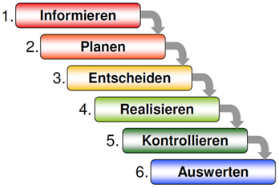
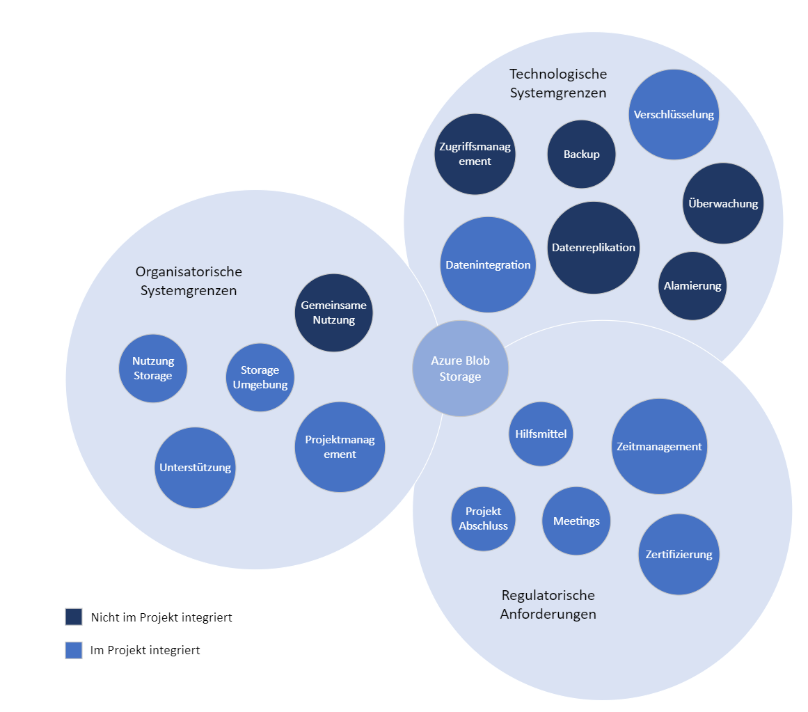
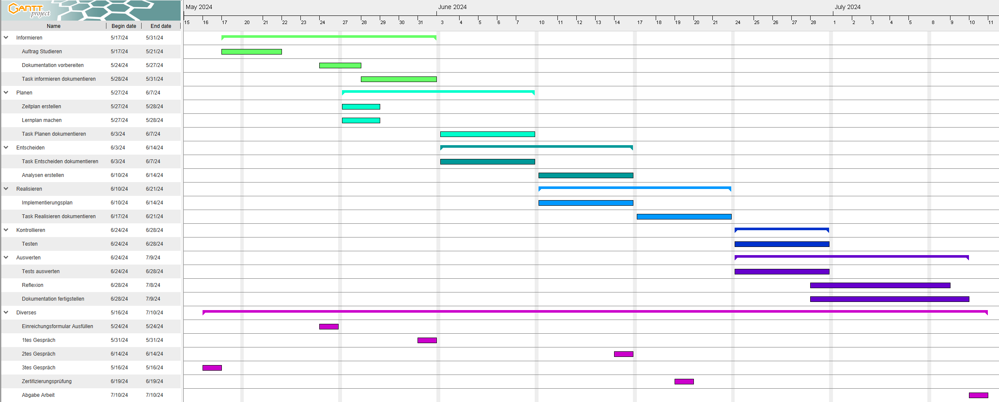
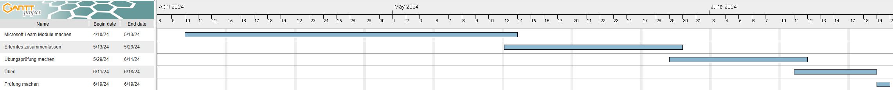

# Blob Storage & Azure Zertifizierung 

- [Blob Storage \& Azure Zertifizierung](#blob-storage--azure-zertifizierung)
- [Versionenverzeichniss](#versionenverzeichniss)
- [Teil 1 Einleitung](#teil-1-einleitung)
- [Aufgabenstellung](#aufgabenstellung)
  - [Ausgangslage](#ausgangslage)
  - [Ziele](#ziele)
  - [Mittel und Methoden](#mittel-und-methoden)
    - [Software](#software)
    - [Programmiersprache](#programmiersprache)
  - [Werkzeuge](#werkzeuge)
  - [Methode IPERKA](#methode-iperka)
  - [Seusag](#seusag)
    - [Systemgrenzen](#systemgrenzen)
      - [Technologische Systemgrenzen](#technologische-systemgrenzen)
      - [Organisatorische Systemgrenzen](#organisatorische-systemgrenzen)
      - [Regulatorische Anforderungen](#regulatorische-anforderungen)
- [Projektorganisation](#projektorganisation)
  - [Beteiligte Personen](#beteiligte-personen)
    - [Kanditatin](#kanditatin)
    - [Dozenten](#dozenten)
- [Datensicherung](#datensicherung)
- [Zeitplan](#zeitplan)
- [Lernplan](#lernplan)
- [Besprechungsprotokoll](#besprechungsprotokoll)
  - [Zwischengespräch 1](#zwischengespräch-1)
    - [Besprechungsnotiz](#besprechungsnotiz)
  - [Zwischengespräch 2](#zwischengespräch-2)
    - [Besprechungsnotiz](#besprechungsnotiz-1)


# Versionenverzeichniss

| Version | Datum | Autor | Bemerkung | 
| ------- | ------ | ---- | --------- |
| 1.0 | 24.05.2024 | Laura Dubach | Inhaltsverzeichnis, Einleitung Dokumentation |
| 1.1 | 27.05.2024 | Laura Dubach | Titelseite, Weiterarbeit Einleitung Dokumentation, Verlinkung, Zeitplan und Lernplan erstellen |
| 1.2 | 28.05.2024 | Laura Dubach | Thema Informieren dokumentieren, Verlinkung, Zertifizierungstermin buchen |
| 1.3 | 30.05.2024 | Laura Dubach | Zeitplan -und Lernplan anpassen, start zusammenfassung AZ-900 Module, Seusag dokumentieren |
| 1.4 | 31.05.2024 | Laura Dubach | Besprechungsprotokoll schreiben, Notizen im Notion machen |
| 1.5 | 03.06.2024 | Laura Dubach | Kapitel Planung dokumentiert, Kapitel Entscheiden gestartet |
| 1.6 | 05.06.2024 | Laura Dubach | Quellenverzeichniss nachführen, Entscheidungsmatrix starten |
| 1.7 | 10.06.2024 | Laura Dubach | Kapitel Planen & Entscheiden fertigstellen |
| 1.8 | 17.06.2024 | Laura Dubach | Implementierungsplan, Umsetzung dokumentiert |
| 1.9 | 21.06.2024 | Laura Dubach | Gespräch mit Philipp, Besprechungsprotokoll schreiben, Seusag überarbeiten, weiter am Kapitel Umsetzung dokumentieren |
| 2.0 | 01.07.2024 | Laura Dubach | Testfälle dokumentiert, Thema Sicherheit dokumentiert, Quellen verlinkt |
| 2.1 | 08.07.2024 | Laura Dubach | Rechtschreibung anschauen, Dokument fertigstellen |

# Teil 1 Einleitung
Mit der erfolgreichen Umsetzung dieses Projekts wird das Unternehmen in der Lage sein, große Datenmengen effizient, sicher und kostengünstig zu speichern und zu verwalten. Dies führt zu einer verbesserten Datenverfügbarkeit, niedrigeren Betriebskosten und einer erhöhten Gesamteffizienz im Datenmanagement.

# Aufgabenstellung
Das Projekt umfasst eine umfassende Analyse der aktuellen Speicheranforderungen von Unternehmen. Besonderheiten und Herausforderungen von Big Data, wie Volumen, Geschwindigkeit und Vielfalt der Daten, werden ebenfalls beleuchtet. Es erfolgt eine Bewertung von zwei verschiedenen Speichertechnologien im Kontext von Big Data, wobei Vor- und Nachteile detailliert erarbeitet werden. Auf Basis dieser Analyse wird ein Implementierungsplan für die beste Speicherlösung erstellt. Die ausgewählte Speicherlösung ist Azure Blob Storage, das Flexibilität, Skalierbarkeit und Kosteneffizienz bietet. Ein weiterer Bestandteil des Projekts ist der Lernweg der HF Lernenden, um die Azure Fundamentals Zertifizierung zu erlangen. Dies stellt sicher, dass die Lernende die Azure-Umgebung effektiv nutzen und verwalten kann.

## Ausgangslage
Viele Unternehmen stehen vor der Herausforderung, große Mengen an Daten effizient und kostengünstig zu speichern und zu verwalten. Die traditionellen Speichermethoden sind oft nicht skalierbar, teuer und schwierig zu sichern und zu verwalten. Unternehmen benötigen eine Lösung, die nicht nur skalierbar und kosteneffizient ist, sondern auch hohe Verfügbarkeit, Sicherheit und einfache Verwaltung bietet. 

## Ziele
1. Analyse der aktuellen Speicheranforderungen von Unternehmen
   - Erhebung und Darstellung der spezifischen Bedürfnisse von Unternehmen hinsichtlich Datenvolumen, Zugriffszeiten und Sicherheit. 
   - Besonderheiten und Herausforderungen von Big Data (z. B. Volumen, Geschwindigkeit, Vielfalt, Auswertung). 

2. Analyse und Bewertung von Speichertechnologien im Kontext von Big Data 
   - Eine Analyse von zwei Storages durchführen. 
   - Erarbeitung der Vor- und Nachteile der Storages 

3. Praktische Implementierung und Verwaltung: 
   - Erarbeitung eines Implementierungsplans für eine ausgewählte Speicherlösung. 
   - Darstellung der Verwaltungswerkzeuge und -prozesse für den laufenden Betrieb. 
   - Spezifische Verwaltungsherausforderungen und -lösungen für Big Data. 

4. Azure Fundamentales Zertifizierung 
   - Lernprozess beschreiben

## Mittel und Methoden
### Software
- Azure Portal
- Microsoft Azure Storage Explorer

### Programmiersprache
- CLI (bash)

## Werkzeuge
- Visio
- Excel
- github
- Visual Studio Code
- Chat GPT
- Microsoft Learn
- Ganttproject
- Notion

## Methode IPERKA
Dies ist eine Sechs-Schritte-Methode, welche man für die Umsetzung eines Projektes verwendet. Sie hilft dabei, ein Projekt von Grund auf gut zu planen und zu verstehen. Man soll jeden Schritt genau durchführen, um jegliche Probleme umgehen zu können. Zum Schluss der Methode wird auch verlangt, dass man das Projekt reflektiert, um aus allfälligen Fehlern auch lernen zu können.  
> (Bexio 2020) [Quelle](https://www.bexio.com/de-CH/blog/view/iperka-methode)



Für diese Methode habe ich mich entschieden, da wir diese in meiner Lehre für alle Projekte angewandt haben und ich gute Erfahrungen damit gemacht habe. Dadurch kenne ich diese Methode schon gut und kann sie dementsprechend anwenden.

## Seusag
### Systemgrenzen



#### Technologische Systemgrenzen
- Zugriffsmanagement: Berechtigungskonzept gehört nicht zu diesem Projekt dazu
- Datenreplikation: Die Daten werden nicht repliziert
- Datenintegration: Es werden Testdaten im Storage integriert, jedoch nur für Testzwecke und zur Darstellung
- Verschlüsselung: Die Verschlüsselung der Daten wird beschrieben und angewendet
- Überwachung und Alarmierung: Es wir kein Monitoring implementiert oder beschrieben
- Backup und Wiederherstellung: Das Backup vom BlobStorage wird in diesem Projekt nicht angewendet oder beschrieben

#### Organisatorische Systemgrenzen
- Storage Umgebung: Die Umgebung des Storages wird gezeigt und erläutert
- Gemeinsame Nutzung: Es wird kein zweiter user erstellt, oder die gemeinsame Nutzung erläutert
- Nutzung Storage: Die Nutzung des Azure Blob Storage wird beschrieben
- Projektmanagement: Die Methode wird beschrieben und umgesetzt
- Unterstützung: Zur Unterstützung des Projektes werden die Fachdozenten und die Modulunterlagen verwendet

#### Regulatorische Anforderungen
- Zertifizierung: Die erfolgreiche Absolvierung der AZ-900 Zertifizierung ist nicht erforderlich, jedoch wird der Lernweg und die Vorbereitung beschrieben
   - Ausgeschlossen ist eine weitere Zertifizierung
- Abschluss: Das Enddatum dieses Projektes ist verbindlich. Nach dem Abschluss des Projektes wird keine Nachbearbeitung geplant
- Meetings: Es weden Zwischengespräche mit dem Fachdozenten gehalten und diese werden dokumentiert. Meetings werden mit dem Fachdozenten geplant und angepasst
- Hilfsmittel: Alle Hilfsmittel für die Zertifizierung und die Umsetzung des Projektes sind vorhanden

# Projektorganisation
## Beteiligte Personen

### Kanditatin

```
Laura Joana Dubach
Funktion: Projektleiterin
P: 079 355 78 24
Github: lauradubach
E-Mail: laura.dubach@itnetx.ch
```
### Dozenten

```
Philipp Rohr
Funktion: Fachdozent
Github: phrohr
E-Mail: philipp.rohr@tbz.ch
```
```
Samuel Müller
Funktion: Fachdozent
Github: 404samnotfound
E-Mail: samuel.mueller1@tbz.ch
```
```
Thanam Pangri
Funktion: Fachdozent
Github: tpangri
E-Mail: thanam.pangri@tbz.ch
```

# Datensicherung
Damit keine Daten verloren gehen können, werde ich alle Dokumente auf meinem OneDrive abspeichern. Zusätzlich werde ich die Daten auf einen USB-Stick abspeichern, damit ich im Worstcase Szenario immer noch ein Backup besitze. 

# Zeitplan



# Lernplan



# Besprechungsprotokoll
## Zwischengespräch 1

| Besprechung | Datum | Uhrzeit | Teilnehmer | 
| ---- | ---- | ---- | ---- |
| 1 | 31.05.2024 | 18:15 - 18:30 | Philipp Rohr, Laura Dubach |

### Besprechungsnotiz

Vor dem Gespräch habe ich mir einige Gedanken gemacht, was für Fragen ich stellen möchte. Diese habe ich mir dann im Notion notiert.

1. Darf ich ChatGPT für meine texte verwenden
2. Kunde erfinden oder allgemein schreiben
3. Wie soll ich AZ-900 integrieren 

Danach habe ich mich mit Philipp über Teams getroffen. Er meinte ChatGPT soll ich unbedingt verwenden, da es auch Zukunft ist. Wichtig ist einfach, dass ich die Quellen angebe. Zum Thema wie ich den Kunde einbauen soll, meinte er, am besten einen Kunden zu erfinden. So kann ich alles besser beschreiben und es gibt keine Verwirrungen. Jedoch kann ich es auch allgemein lassen, was ich wahrscheinlich machen werde, da ich mit der Beschreibung schon sehr weit bin. Zur letzten Frage wie ich die Zertifizierung einfliessen lassen soll, sagte er, ich soll meinen Lernweg aufzeigen und dann einen fliessenden Übergang zu meinem Thema machen, welches in der Lernunterlagen des AZ-900 aufzufinden ist. 

Das Gespräch war sehr gut und Philipp konnte all meine Fragen beantworten. So kann ich meine Semesterabreit nun gut weiterführen.

## Zwischengespräch 2

| Besprechung | Datum | Uhrzeit | Teilnehmer | 
| ---- | ---- | ---- | ---- |
| 2 | 21.06.2024 | 19:00 | Philipp Rohr, Laura Dubach |

### Besprechungsnotiz

Wie beim ersten Gespräch, habe ich mir im vorhinein meine Fragen im Notion notiert.

1. Seusag gemeinsam anschauen
2. Darstellung der Verwaltungswerkzeuge und -Prozesse für den laufenden Betrieb -> Was ist damit effektiv gemeint, wie soll ich das dokumentieren?
3. Implementierungsplan gemeinsam anschauen
4. Abbildungsverzeichnis wie soll ich dies darstellen?

Nun habe ich mich mit Philipp über Teams getroffen. Wir haben uns meine Seusag Grafik angeschaut. Er hatte ein paar Ideen, womit man die Grafik besser versteht. Ausserdem die Titel anzupassen oder die Farbgebung zu verändern, sodass man nachvollziehen kann, was im Projekt integriert wird und was nicht. Das eine Ziel "Darstellung der Verwaltungswerkzeuge und -Prozesse für den laufenden Betrieb" sollte ich als Endprodukt darstellen, so wie ich es mir ungefähr schon gedacht hatte. Danach haben wir mein Implementierungsplan angesehen. Diesen fand er gut und deshalb belasse ich ihn so. Das Abbildungsverzeichnis kann ich weglassen, meinte er, da die Verlinkung zu kompliziert sei und zu lange dauert. Zum Schluss haben wir uns noch die Quellen angesehen. Dort sollte ich noch bei den angegebenen Seiten den Link miteinfügen.

Das Gespräch verlief gut und nun kann ich weiterarbeiten und die Anpassungen vornehmen.


> Back [Page](https://github.com/lauradubach/Semesterarbeit1/blob/main/README.md)
>
> Next [Page](https://github.com/lauradubach/Semesterarbeit1/blob/main/Sites/Teil%202%20Vorbereitung.md)
