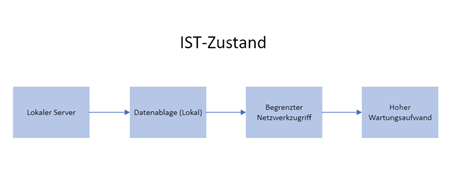
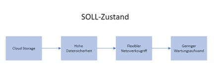
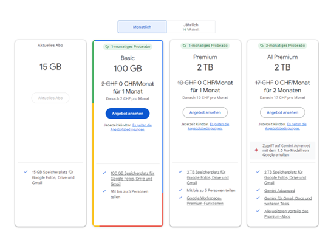
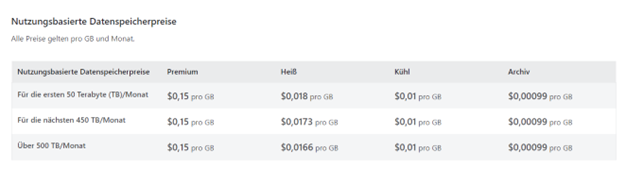

# Teil 2 Vorbereitung

- [Teil 2 Vorbereitung](#teil-2-vorbereitung)
- [Informieren](#informieren)
  - [Bedürfnisse der Unternehmen](#bedürfnisse-der-unternehmen)
    - [Datenvolumen](#datenvolumen)
    - [Zugriffszeiten](#zugriffszeiten)
    - [Sicherheit](#sicherheit)
    - [Zusammenfassung](#zusammenfassung)
  - [Beschreibung Big Data](#beschreibung-big-data)
    - [Fazit](#fazit)
  - [Vorbereitung Zertifizierung](#vorbereitung-zertifizierung)
- [Planen](#planen)
  - [Ist Situation](#ist-situation)
  - [Soll Situation](#soll-situation)
- [Entscheiden](#entscheiden)
  - [Produkt Vergleich](#produkt-vergleich)
    - [Google Cloud Storage](#google-cloud-storage)
    - [Azure Blob Storage](#azure-blob-storage)
    - [Vor -und Nachteile](#vor--und-nachteile)
  - [Kostenanalyse](#kostenanalyse)
    - [Google Cloud Storage](#google-cloud-storage-1)
    - [Azure Blob Storage](#azure-blob-storage-1)
    - [Details zusammengetragen](#details-zusammengetragen)
      - [Speicherpreise (pro GB/Monat)](#speicherpreise-pro-gbmonat)
      - [Datenübertragungskosten (pro GB)](#datenübertragungskosten-pro-gb)
      - [Lesevorgänge (pro 10.000 Operationen)](#lesevorgänge-pro-10000-operationen)
      - [Schreibvorgänge (pro 10.000 Operationen)](#schreibvorgänge-pro-10000-operationen)
  - [Entscheidungsmatrix](#entscheidungsmatrix)
    - [Berechnung der Ergebnisse](#berechnung-der-ergebnisse)
    - [Zusammenfassung der Ergebnisse](#zusammenfassung-der-ergebnisse)

# Informieren
In diesem Kapitel werde ich Informationen zu meiner Arbeit beschaffen und diese erläutern.

## Bedürfnisse der Unternehmen
Unternehmen haben spezifische Anforderungen an Datenvolumen, Zugriffszeiten und Sicherheit, die je nach Branche, Größe und Geschäftsmodell variieren. Hier ist eine detaillierte Beschreibung dieser Bedürfnisse und wie sie typischerweise erhoben und dargestellt werden.

### Datenvolumen
   - Geschäftsanforderungen: Unternehmen analysieren ihre operativen Prozesse, Kundendaten und Markttrends, um das benötigte      Datenvolumen zu ermitteln. 
   - Zukünftiges Wachstum: Prognosen und Szenarioanalysen helfen bei der Abschätzung zukünftiger Datenmengen basierend auf Unternehmenswachstum und digitalen Transformationen.
   - Branchenvergleiche: Benchmarking gegen andere Unternehmen der Branche kann Aufschluss über übliche Datenvolumen geben.
   - Kapazitätsplanung: Erstellung von Berichten, die den aktuellen und prognostizierten Speicherbedarf darstellen, oft visualisiert durch Diagramme und Grafiken.
   - Datenstrategie-Dokumente: Detaillierte Strategien, welche die kurz- und langfristigen Speicheranforderungen sowie Skalierungspläne enthalten.

### Zugriffszeiten
   - Anforderungsanalyse: Durchführung von Anforderungsanalysen bei verschiedenen Abteilungen (z. B. Marketing, Vertrieb, Produktion), um die benötigten Zugriffszeiten zu bestimmen.
   - Performance-Tests: Simulation von Datenzugriffen und Auswertungen der Reaktionszeiten, um die Anforderungen an Echtzeit- oder Batch-Verarbeitung zu verstehen.
   - Nutzerfeedback: Einholen von Feedback von Endbenutzern und IT-Teams, um Engpässe und Optimierungsbedarf zu identifizieren.
   - Service-Level-Agreements (SLAs): Dokumentation von SLAs, die genaue Zugriffszeiten und Performance-Kriterien festlegen.
   - Dashboards: Nutzung von Dashboards zur Echtzeit-Überwachung der Systemperformance und Zugriffszeiten um Transparenz und schnelle Reaktionsmöglichkeiten zu gewährleisten.

### Sicherheit
   - Risikobewertung: Durchführung von Risikoanalysen um potenzielle Sicherheitsbedrohungen und Schwachstellen zu identifizieren.
   - Regulatorische Anforderungen: Berücksichtigung von branchenspezifischen Vorschriften und gesetzlichen Anforderungen (z. B. GDPR, HIPAA).
   - Sicherheitsaudits: Regelmäßige Sicherheitsaudits und Penetrationstests zur Überprüfung der aktuellen Sicherheitsmaßnahmen und Identifikation von Verbesserungsmöglichkeiten.
   - Sicherheitsrichtlinien: Erstellung und Aktualisierung umfassender Sicherheitsrichtlinien, welche alle Aspekte des Datenmanagements abdecken.
   - Berichte und Dashboards: Regelmäßige Berichterstattung über Sicherheitsvorfälle und -maßnahmen, oft unterstützt durch Dashboards, die Echtzeit-Überwachung ermöglichen.

### Zusammenfassung
Unternehmen müssen ihre spezifischen Bedürfnisse hinsichtlich Datenvolumen, Zugriffszeiten und Sicherheit klar verstehen und darstellen, um ihre IT-Infrastruktur effizient zu planen und zu verwalten. Diese Bedürfnisse werden durch detaillierte Analysen, Simulationen und Nutzerfeedback erhoben und durch strukturierte Dokumentationen, Dashboards und Berichte visualisiert und kommuniziert. Durch die sorgfältige Erhebung und Darstellung dieser Anforderungen können Unternehmen sicherstellen, dass ihre Datenstrategien effektiv, skalierbar und sicher sind.

> (Chat GPT) [Quelle](https://chatgpt.com/share/ab401ba2-2bc1-490b-97b7-0efba4cb4ced)

## Beschreibung Big Data
Big Data ist ein Begriff, der die große Menge, Geschwindigkeit und Vielfalt an Daten beschreibt, welche die Unternehmen und Organisationen heutzutage verarbeiten und analysieren müssen. Die Besonderheiten und Herausforderungen von Big Data lassen sich in vier Hauptdimensionen zusammenfassen: Volumen, Geschwindigkeit, Vielfalt und Auswertung.

| **Aspekt** | **Besonderheiten** | **Herausforderungen** |
|----------------|-------------------------------------------------------------------------------------|------------------------------------------------------------------------------------------------------------|
| **Volumen** | - Enorme Menge an Daten aus sozialen Medien, Transaktionsdaten, Sensoren, etc. | - Speicherung: Erfordert spezialisierte, kosteneffiziente und skalierbare Speicherlösungen |
| | - Moderne Technologien wie IoT und Internetnutzung treiben das Datenwachstum an | - Verwaltung: Benötigt robuste Datenmanagement-Systeme für Zugänglichkeit, Sicherheit und Organisation |
| **Geschwindigkeit** | - Daten müssen oft in Echtzeit oder nahezu in Echtzeit verarbeitet werden | - Verarbeitung in Echtzeit: Erfordert leistungsstarke und effiziente Datenverarbeitungstechnologien |
| | - Beispiele: Finanztransaktionen, Online-Werbung, Überwachungsdaten | - Latenzzeit: Minimierung der Latenzzeit ist entscheidend für rechtzeitige Entscheidungsfindung |
| **Vielfalt** | - Verschiedene Datenformen: strukturierte, unstrukturierte und semi-strukturierte Daten | - Integration: Komplexität der Integration unterschiedlicher Datenquellen und -formate |
| | - Quellen: Soziale Medien, Mobilgeräte, Sensoren, Unternehmenssysteme | - Analyse: Erfordert fortschrittliche Techniken wie maschinelles Lernen und natürliche Sprachverarbeitung |
| **Auswertung** | - Analyse und Interpretation von Daten zur Gewinnung wertvoller Erkenntnisse | - Datenqualität: Sicherstellung der Genauigkeit und Zuverlässigkeit der Daten |
| | - Techniken: Data Mining, maschinelles Lernen, statistische Analysen | - Datenschutz: Schutz der Privatsphäre und Einhaltung von Datenschutzgesetzen |
| |                                                         | - Fachwissen: Bedarf an spezialisierten Fachkräften für Big Data-Technologien und -Methoden | 

### Fazit
Big Data bietet enorme Möglichkeiten, bringt aber auch erhebliche Herausforderungen mit sich. Unternehmen und Organisationen müssen in geeignete Technologien, Prozesse und Fachkräfte investieren, um das Potenzial von Big Data voll auszuschöpfen und gleichzeitig die damit verbundenen Herausforderungen zu bewältigen.

> (Chat GPT) [Quelle](https://chatgpt.com/share/ab401ba2-2bc1-490b-97b7-0efba4cb4ced)

## Vorbereitung Zertifizierung
Um mich gut auf die Zertifizierung vorzubereiten, werde ich als erstes einen Lernplan erstellen.

Folgende Punkte werde ich verfolgen:
  1. Alle Module im Microsoft Learn abschliessen
  2. Jedes Modul Zusammenfassen und in einem Repository dokumentieren
  3. Die Probeprüfung im Microsoft Learn absolvieren und üben
  4. Wenn nötig Braindups kaufen und mit diesen weiterlernen
  5. Bei Dozenten um Ratschläge un Tipps fragen

# Planen
In diesem Kapitel werde ich die Planung des Projektes schildern.

## Ist Situation

- Datenablage: Daten werden lokal auf physischen Servern oder auf einfachen Netzwerkspeichern abgelegt.
- Datensicherheit: Mögliche Sicherheitsrisiken durch fehlende Verschlüsselung und Redundanz.
- Datenzugriff: Begrenzter Zugriff auf Daten, eventuell nur innerhalb des Firmennetzwerks.
- Wartung und Skalierbarkeit: Hoher Wartungsaufwand und eingeschränkte Skalierbarkeit durch physische Hardware.

## Soll Situation

- Datenablage: Daten sind jetzt in einem skalierbaren und redundanten Blob Storage in der Cloud abgelegt.
- Datensicherheit: Verbesserte Sicherheitsmassnahmen durch Verschlüsselung und Zugriffskontrollen.
- Datenzugriff: Flexibler und sicherer Zugriff auf Daten von überall, auch für mobile Nutzer.
- Wartung und Skalierbarkeit: Geringerer Wartungsaufwand und hohe Skalierbarkeit durch Nutzung der Cloud-Infrastruktur.
- Kostenkontrolle: Bessere Kostentransparenz und -kontrolle durch nutzungsabhängige Abrechnung.

# Entscheiden
In diesem Kapitel werden die Entscheidungen des Projektes aufgezeigt.

## Produkt Vergleich
### Google Cloud Storage

Google Cloud Storage (GCS) ist ein skalierbarer, hochverfügbarer Objektspeicherdienst von Google Cloud, der eine flexible und zuverlässige Speicherung von Daten jeder Größe ermöglicht. Daten werden in Form von Objekten innerhalb von Buckets gespeichert, die jeweils einen weltweit eindeutigen Namen haben. GCS bietet verschiedene Speicherklassen die auf unterschiedliche Zugriffs- und Kostenanforderungen zugeschnitten sind:
- Standard Storage für häufigen Zugriff
- Nearline Storage für monatlichen Zugriff
- Coldline Storage für jährlichen Zugriff
- Archive Storage für seltenen oder nie benötigten Zugriff.

Der Dienst ist hoch skalierbar und gewährleistet eine Verfügbarkeit von 99,95% und eine Datenlanglebigkeit von 99,999999999% (11 Neunen). Sicherheit wird durch standardmäßige Verschlüsselung der Daten im Ruhezustand und während der Übertragung sowie durch fein abgestimmte Zugangskontrollen über Identity und Access Management (IAM) gewährleistet. GCS unterstützt auch Lebenszyklusrichtlinien, die das automatische Verschieben oder Löschen von Objekten ermöglichen. Google Cloud Storage lässt sich nahtlos in andere Google Cloud-Dienste und Drittanbieteranwendungen integrieren und eignet sich für verschiedene Anwendungsfälle wie Datensicherung und -wiederherstellung, Content Delivery, Big Data und Analyse sowie Archivierung. Die Preisgestaltung basiert auf Speicherklasse, Datenmenge, Datenzugriff, Operationen und Netzwerknutzung, wodurch eine flexible Kostenstruktur geboten wird.

Insgesamt bietet GCS eine leistungsfähige, flexible und sichere Lösung für Unternehmen, die große Datenmengen verwalten müssen.

> (Chat GPT) [Quelle](https://chatgpt.com/share/b9298106-d1f5-40d3-addb-54bffea62c57)

### Azure Blob Storage

Azure Blob Storage ist ein skalierbarer und hochverfügbarer Objektspeicherdienst von Microsoft Azure, der eine flexible und zuverlässige Speicherung von Daten jeder Größe ermöglicht. Daten werden in Form von Blobs (Binary Large Objects) innerhalb von Containern gespeichert, die jeweils einen eindeutig identifizierbaren Namen haben. Azure Blob Storage bietet verschiedene Zugriffsebenen, die auf unterschiedliche Zugriffs- und Kostenanforderungen zugeschnitten sind: 

- Hot Access Tier für häufigen Zugriff
- Cool Access Tier für seltenen Zugriff (mindestens 30 Tage gespeichert)
- Archive Access Tier für langfristige Speicherung von Daten, auf die selten oder nie zugegriffen wird. (mindestens 180 Tage gespeichert)

Der Dienst ist hoch skalierbar und gewährleistet eine hohe Verfügbarkeit sowie eine Datenlanglebigkeit von 99,99999999999999% (16 Neunen). Sicherheit wird durch standardmäßige Verschlüsselung der Daten im Ruhezustand und während der Übertragung sowie durch fein abgestimmte Zugangskontrollen über Role-Based Access Control (RBAC) und Azure Active Directory (AAD) gewährleistet. Azure Blob Storage unterstützt auch Lebenszyklusrichtlinien, die das automatische Verschieben oder Löschen von Blobs basierend auf benutzerdefinierten Regeln ermöglichen. Azure Blob Storage lässt sich nahtlos in andere Azure-Dienste und Drittanbieteranwendungen integrieren und eignet sich für verschiedene Anwendungsfälle wie Datensicherung und -wiederherstellung, Content Delivery, Big Data und Analyse sowie Archivierung. Die Preisgestaltung basiert auf Zugriffsebene, Datenmenge, Datenzugriff, Operationen und Netzwerknutzung, wodurch eine flexible Kostenstruktur geboten wird.

Insgesamt bietet Azure Blob Storage eine leistungsfähige, flexible und sichere Lösung für Unternehmen, die große Datenmengen verwalten müssen.

> (Chat GPT) [Quelle](https://chatgpt.com/share/b9298106-d1f5-40d3-addb-54bffea62c57)

### Vor -und Nachteile

| **Vorteile** | Azure Blob Storage | Google Cloud Storage |
|--------------|--------------------|----------------------|
| **Skalierbarkeit** | Hoch skalierbar und unterstützt große Datenmengen. | Ebenfalls hoch skalierbar und bietet Unterstützung für Exabytes an Daten. |
| **Verfügbarkeit** | Hohe Verfügbarkeit mit Service Level Agreements (SLAs) für bestimmte Dienstebenen. | Hohe Verfügbarkeit mit einem SLA von 99,95% für Multi-Region Buckets. |
| **Sicherheit** | Standardmäßige Verschlüsselung der Daten im Ruhezustand und während der Übertragung. Zugangskontrolle über Role-Based Access Control (RBAC) und Azure Active Directory (AAD). | Standardmäßige Verschlüsselung der Daten im Ruhezustand und während der Übertragung. Zugangskontrolle über Identity and Access Management (IAM). |
| **Flexibilität** | Verschiedene Zugriffsebenen (Hot, Cool, Archive) für unterschiedliche Anforderungen an Datenzugriff und Kosten. | Verschiedene Speicherklassen (Standard, Nearline, Coldline, Archive) für unterschiedliche Anforderungen an Datenzugriff und Kosten. |
| **Integration** | Nahtlose Integration in andere Azure-Dienste und Microsoft-Ökosysteme. | Nahtlose Integration in andere Google Cloud-Dienste und Drittanbieteranwendungen. |
| **Preisgestaltung** | Transparente Preisgestaltung mit verschiedenen Optionen für Speicherung, Zugriff und Netzwerknutzung. | Transparente Preisgestaltung mit verschiedenen Optionen für Speicherung, Zugriff und Netzwerknutzung. |

| **Nachteile** | Azure Blob Storage | Google Cloud Storage |
|---------------|---------------------|-----------------------|
| **Lernkurve** | Komplexität der Dienste und Konfigurationen erfordert möglicherweise eine steilere Lernkurve für Anfänger. | Komplexität der Dienste und Konfigurationen erfordert möglicherweise eine steilere Lernkurve für Anfänger. |
| **Regionale Verfügbarkeit** | Kann je nach Region möglicherweise nicht so weit verbreitet sein wie die Dienste von Google Cloud. | Kann je nach Region möglicherweise nicht so weit verbreitet sein wie die Dienste von Azure. |
| **Preisvariation** | Die Preisgestaltung kann je nach gewählter Zugriffsebene und Region variieren. | Die Preisgestaltung kann je nach gewählter Speicherklasse und Region variieren. |

> (Chat GPT) [Quelle](https://chatgpt.com/share/b9298106-d1f5-40d3-addb-54bffea62c57)

## Kostenanalyse
### Google Cloud Storage

> (Google One) [Quelle](https://one.google.com/about/plans?hl=de&g1_landing_page=0)

### Azure Blob Storage

> (Microsoft) [Quelle](https://azure.microsoft.com/de-de/pricing/details/storage/blobs/#pricing)

### Details zusammengetragen

#### Speicherpreise (pro GB/Monat)

| Speicherklasse      | Azure Blob Storage | Google Cloud Storage |
|---------------------|--------------------|----------------------|
| Hot/Standard        | $0.0184            | $0.02                |
| Cool/Nearline       | $0.01              | $0.01                |
| Archive/Coldline    | $0.00099           | $0.004               |
| N/A/Archive         | N/A                | $0.0012              |

#### Datenübertragungskosten (pro GB)

| Datenmenge          | Azure Blob Storage | Google Cloud Storage |
|---------------------|--------------------|----------------------|
| 0-1 GB              | Kostenlos          | Kostenlos            |
| 1-5 GB              | Kostenlos          | N/A                  |
| 5 GB-10 TB          | $0.087             | $0.12                |
| 10 TB-50 TB         | $0.083             | $0.11                |

#### Lesevorgänge (pro 10.000 Operationen)

| Speicherklasse      | Azure Blob Storage | Google Cloud Storage |
|---------------------|--------------------|----------------------|
| Hot/Standard        | $0.004             | $0.004               |
| Cool/Nearline       | $0.01              | $0.01                |
| Archive/Coldline    | $0.02              | $0.10                |
| N/A/Archive         | N/A                | $0.50                |

#### Schreibvorgänge (pro 10.000 Operationen)

| Speicherklasse      | Azure Blob Storage | Google Cloud Storage |
|---------------------|--------------------|----------------------|
| Hot/Standard        | $0.005             | $0.05                |
| Cool/Nearline       | $0.1               | $0.10                |
| Archive/Coldline    | $0.1               | $0.10                |
| N/A/Archive         | N/A                | $0.50                |

> (Chat GPT) [Quelle](https://chatgpt.com/share/ad718212-a597-462a-aea5-c63ec35a581d)

## Entscheidungsmatrix

| Kriterium | Gewichtung | Google Cloud Storage | Azure Blob Storage | Bewertung Google | Bewertung Azure | Ergebnis Google | Ergebnis Azure |
|-----------------------------|------------|-----------------------|--------------------|-------------------|-----------------|-----------------|----------------|
| **Kosten** | 20% | Flexible Preismodelle, jedoch etwas teurer bei hoher Nutzung | Wettbewerbsfähige, Preise besonders günstig bei langfristiger Nutzung | 7 | 9 | 1.4 | 1.8 |
| **Leistung** | 15% | Hohe Leistung, schnelle Latenzzeiten | Sehr hohe Leistung, optimiert für verschiedene Nutzungsszenarien | 8 | 9 | 1.2 | 1.35 |
| **Sicherheit** | 20% | Sehr gute Sicherheitsfunktionen | Hervorragende Sicherheitsfunktionen | 8 | 9 | 1.6 | 1.8 |
| **Verfügbarkeit und Zuverlässigkeit** | 15% | Hohe Verfügbarkeit, SLA von 99.95% | Höchste Verfügbarkeit, SLA von 99.99% | 8 | 9 | 1.2 | 1.35 |
| **Integration und Ökosystem** | 10% | Gute Integration mit Google-Diensten und -Tools | Hervorragende Integration mit Microsoft-Diensten und Tools | 7 | 9 | 0.7 | 0.9 |
| **Support und Dokumentation** | 10% | Ausgezeichneter Support und umfassende Dokumentation | Hervorragender Support, besonders für Unternehmen | 8 | 9 | 0.8 | 0.9 |
| **Skalierbarkeit** | 10% | Sehr gute Skalierbarkeit | Hervorragende Skalierbarkeit mit verschiedenen Speicheroptionen | 8 | 9 | 0.8 | 0.9 |

### Berechnung der Ergebnisse
- Bewertung: Skala von 1 bis 10 (1 = schlecht, 10 = hervorragend)
- Gewichtung: Prozentuale Bedeutung des Kriteriums
- Ergebnis: Bewertung * Gewichtung

### Zusammenfassung der Ergebnisse

| Speicherlösung              | Gesamtpunktzahl |
|-----------------------------|-----------------|
| **Google Cloud Storage**    | 7.7             |
| **Azure Blob Storage**      | 9.0             |

> (Chat GPT) [Quelle](https://chatgpt.com/share/f637a063-7f8f-4ff2-b3e5-e574230ce749)

> Back [Page](https://github.com/lauradubach/Semesterarbeit1/blob/main/Sites/Teil%201%20Einleitung.md)
>
> Next [Page](https://github.com/lauradubach/Semesterarbeit1/blob/main/Sites/Teil%203%20Realisieren.md)