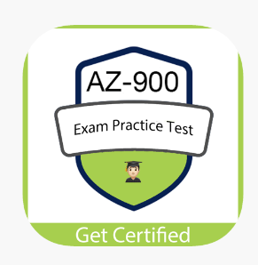
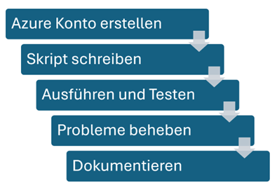
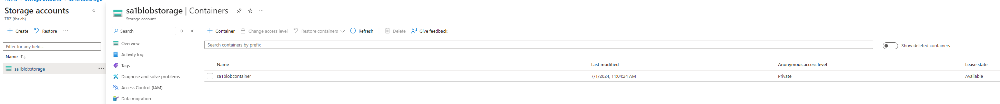
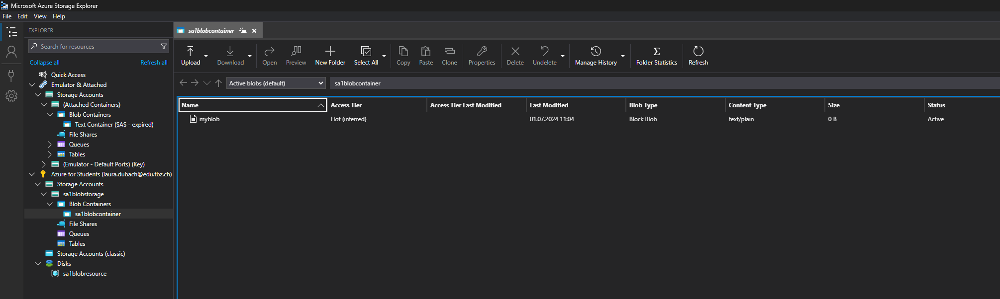

# Teil 3 Realisieren

- [Teil 3 Realisieren](#teil-3-realisieren)
- [Umsetzung](#umsetzung)
  - [Lernprozess Zertifizierung](#lernprozess-zertifizierung)
    - [Module lesen und Zusammenfassen](#module-lesen-und-zusammenfassen)
    - [Übungen machen](#übungen-machen)
  - [Implementierungsplan](#implementierungsplan)
  - [CLI](#cli)
  - [Sicherheit](#sicherheit)
  - [Probleme](#probleme)
  - [Endprodukt](#endprodukt)
  - [Fallbacksolution](#fallbacksolution)
- [Kontrollieren](#kontrollieren)
  - [Testing](#testing)
    - [Testkonzept](#testkonzept)
    - [Testdurchführung](#testdurchführung)
  - [Schulung Kunde](#schulung-kunde)


# Umsetzung
In diesem kapitel wird die Umsetzung des Projektes beschrieben und genaue gezeigt.

## Lernprozess Zertifizierung
Um mich optimal auf die Zertifizierung vorzubereiten habe ich einige Lernschritte verfolgt

### Module lesen und Zusammenfassen
Als ich alle Azure Module von Microsoft Learn durchgearbeitet habe, habe ich alle in einem Repository zusammengefasst
https://github.com/lauradubach/AZ-900

Diese habe ich dann durchgelesen und studiert.

### Übungen machen
Nun habe ich gestartet mit Braindumps und Probeprüfungen. Folgende Sites habe ich verwendet:
1. https://www.passnexam.com/microsoft/az-900
2. https://www.examtopics.com/exams/microsoft/az-900/view/
3. https://learn.microsoft.com/en-us/credentials/certifications/azure-fundamentals/practice/assessment?assessment-type=practice&assessmentId=23&practice-assessment-type=certification

Da mir dies nicht ganz gereicht hat, habe ich mir eine Mobileapp heruntergeladen und mit dieser Täglich geübt



## Implementierungsplan

In diesem Plan wird aufgezeigt, wie ich grob vorgegangen bin



Zuerst wurde das Azure Konto von der Schule erstellt und eingerichtet. Danach habe ich mit dem Skript gestartet und dies dann ausgeführt, getestet und überarbeitet. Alle Probleme die ich hatte, habe ich dokumentiert und wenn ich nicht weitergekommen bin, habe ich mir bei den Fachexperten Hilfe geholt.

## CLI
Um mein Projekt umzusetzten, habe ich ein Bash Skript geschrieben.

```bash
#!/bin/bash

if ! az account show > /dev/null 2>&1; then
  echo "Bitte melde dich bei der Azure CLI an..."
  az login
fi

# Variablen setzen
RESOURCE_GROUP="sa1blobresource"
LOCATION="switzerlandnorth"
STORAGE_ACCOUNT_NAME="sa1blobstorage"
CONTAINER_NAME="sa1blobcontainer"
FILES_TO_UPLOAD="C:\Users\laura\Documents\Test.txt"
EXPIRY_DATE=$(date -u -d "1 day" '+%Y-%m-%dT%H:%MZ')

# Azure Resource Group erstellen
az group create --name $RESOURCE_GROUP --location $LOCATION

# Azure Storage Account erstellen
az storage account create --name $STORAGE_ACCOUNT_NAME --resource-group $RESOURCE_GROUP --location $LOCATION --sku Standard_LRS --kind StorageV2

# Blob-Container erstellen
az storage container create --account-name $STORAGE_ACCOUNT_NAME --name $CONTAINER_NAME

#Account key erstellen
ACCOUNT_KEY=$(az storage account keys list --account-name $STORAGE_ACCOUNT_NAME --query "[?keyName=='key2'].value" --output tsv --output tsv)

# SAS-Token generieren
SAS_TOKEN=$(az storage container generate-sas --name $CONTAINER_NAME --account-name $STORAGE_ACCOUNT_NAME \
    --permissions rwdl --expiry $EXPIRY_DATE --auth-mode key \
    --account-key $ACCOUNT_KEY)

# Vollständige SAS-URL
SAS_URL="https://${STORAGE_ACCOUNT_NAME}.blob.core.windows.net/${CONTAINER_NAME}?${SAS_TOKEN}"

echo $SAS_TOKEN
echo $SAS_URL

# Dateien hochladen mit az storage blob upload-batch
az storage blob upload --account-name $STORAGE_ACCOUNT_NAME --account-key $ACCOUNT_KEY --container-name $CONTAINER_NAME --file $FILES_TO_UPLOAD --name myblob

echo "Dateien erfolgreich hochgeladen."
```

## Sicherheit
Damit die Daten Geschützt werden, wird ein SAS-Token erstellt. Ein SAS-Token ermöglichen den sicheren, delegierten Zugriff auf Ressourcen im Azure-Speicherkonto.

## Probleme
Folgenden Error habe ich erhalten:

``ERROR: incorrect usage: specify '--auth-mode login' when as-user is enabled``

Er hatte ein Problem mit dem Key erstellen, den Code musste ich anschliessend anpassen:

```bash
#Account key erstellen
ACCOUNT_KEY=$(az storage account keys list --account-name $STORAGE_ACCOUNT_NAME --query "[?keyName=='key2'].value" --output tsv --output tsv)

#SAS-Token generieren
SAS_TOKEN=$(az storage container generate-sas --name $CONTAINER_NAME --account-name $STORAGE_ACCOUNT_NAME \
    --permissions rwdl --expiry $EXPIRY_DATE --auth-mode key \
    --account-key $ACCOUNT_KEY)
```

Fogendes habe ich gemacht:

Der code für den Key zu erstellen war zuerst am falschen Platz. Diesen musste ich zuerst erstellen. Dann musste ich im code noch as-user entfernen, da dies nicht gepasst hat und er dies nicht im kontext gekannt hat. Zusätzlich musste ich die Line ``--name $CONTAINER_NAME`` nach oben verschieben.

Danach kam das nächste problem:

``azcopy: command not found``

Ich habe dann az Storage upload verwendet, weil es mit azcopy nicht geklappt hat.

Folgenden Link habe ich verwendet: https://learn.microsoft.com/en-us/cli/azure/storage/blob?view=azure-cli-latest

## Endprodukt
Mit dem CLI Skript wird alles automatisch erstellt und zur veranschauung wird ein Test File bereits hochgeladen. Es können über den Microsoft Azure Storage Explorer weitere Files hochgeladen werden, welche Automatisch auch in der Azure Cloud gespeichert werden.

Ansicht Azure Cloud:



Ansicht vom Microsoft Azure Storage Explorer:




## Fallbacksolution
Wenn etwas nicht klappen würde, habe ich ein Zusätzliches Skript geschrieben, welches die erstellten recoursen wieder löscht.

Hier das Skript:
```bash
#!/bin/bash

# Variablen setzen
RESOURCE_GROUP="sa1blobresource"
STORAGE_ACCOUNT_NAME="sa1blobstorage"

# Prüfen, ob die Azure CLI authentifiziert ist
if ! az account show > /dev/null 2>&1; then
  echo "Bitte melde dich bei der Azure CLI an..."
  az login
fi

# Resource Group löschen
echo "Löschen der Resource Group $RESOURCE_GROUP ..."
az group delete --name $RESOURCE_GROUP --yes --no-wait

# Prüfen, ob die Resource Group gelöscht wurde
if [ $? -eq 0 ]; then
  echo "Resource Group $RESOURCE_GROUP erfolgreich zum Löschen markiert."
else
  echo "Fehler beim Löschen der Resource Group $RESOURCE_GROUP."
  exit 1
fi

# az storage account show --name $STORAGE_ACCOUNT_NAME --resource-group $RESOURCE_GROUP
echo "Löschen des Storage Accounts $STORAGE_ACCOUNT_NAME ..."
az storage account delete --name $STORAGE_ACCOUNT_NAME --resource-group $RESOURCE_GROUP --yes

# Prüfen, ob der Storage Account gelöscht wurde
if [ $? -eq 0 ]; then
  echo "Storage Account $STORAGE_ACCOUNT_NAME erfolgreich gelöscht."
else
  echo "Fehler beim Löschen des Storage Accounts $STORAGE_ACCOUNT_NAME."
  exit 1
fi

echo "Vorgang abgeschlossen."
```

# Kontrollieren
In diesem Kapitel wird das Projekt kontrolliert und getestet.

## Testing
### Testkonzept
| Testperson | Datum |
| ---------- | ----- |
| Laura Dubach | 01.07.2024 |

| System | Testmittel | Testmethode |
| -------| ---------- | ----------- |
| Azure Blob Storage | Skript, Microsoft Azure Storage Explorer, Testfiles | Funktionaler Test |

In diesem Test wird das hochladen von Daten in den Azure Blob Storage getestet. Es wird gezeigt, wie die Daten im Microsoft Azure Storage Explorer angezeigt werden und wie diese direkt auch in der Cloud gespeichert sind.

### Testdurchführung
| Testfall | Erwartetes Ergebnis | Testresultat |
| ---------| ------------------- | ------------ |
| Upload Daten | Die Daten werden hochgeladen und sind im Explorer ersichtlich | Alle Daten wurden hochgeladen und es wurden noch weitere über den upload hinzugefügt: |
| Upload Daten | Die Daten werden hochgeladen und sind im Azure ersichtlich | Alle Daten wurden hochgeladen und sind direkt in der Cloud ersichtlich:  |

## Schulung Kunde
Da die Kunden die Umgebung nicht kennen, würde eine Schulung stattfinden, um den Microsoft Azure Storage Explorer aufzuzeigen und alle Features zu erläutern. Wenn eine Interne IT vorhanden wäre, würde eine weitere Schulung stattfinden, um die ganze Azure Umgebung vorzustellen und zu zeigen, dass auch Sie allfällige Probleme lösen könnten.

> Back [Page](https://github.com/lauradubach/Semesterarbeit1/blob/main/Sites/Teil%202%20Vorbereitung.md)
>
> Next [Page](https://github.com/lauradubach/Semesterarbeit1/blob/main/Sites/Teil%204%20Abschluss.md)
