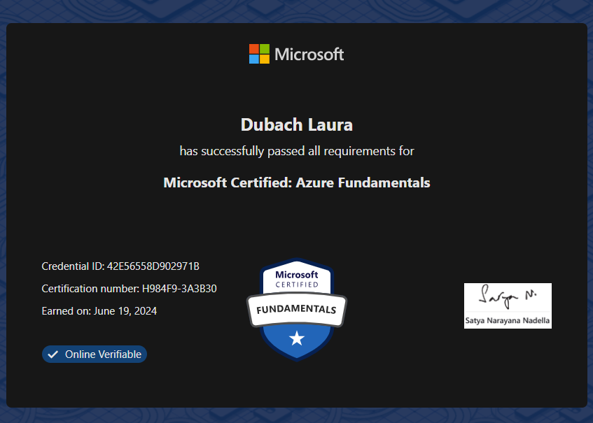

# Teil 4 Abschluss

- [Teil 4 Abschluss](#teil-4-abschluss)
- [Auswerten](#auswerten)
  - [Zertifizierung](#zertifizierung)
  - [Zusammenfassung](#zusammenfassung)
  - [Reflexion](#reflexion)
    - [Persönlich Reflexion](#persönlich-reflexion)
    - [Reflexion der Technischen Umsetzung](#reflexion-der-technischen-umsetzung)
      - [Analysen und Planung](#analysen-und-planung)
      - [Entscheidung](#entscheidung)
      - [Umsetzung des Projektes](#umsetzung-des-projektes)
      - [Datenmigration](#datenmigration)
      - [Optimierung](#optimierung)
    - [Fazit](#fazit)
      - [Kosteneffizienz](#kosteneffizienz)
      - [Skalierbarkeit und Flexibilität](#skalierbarkeit-und-flexibilität)
      - [Sicherheit und Zugänglichkeit](#sicherheit-und-zugänglichkeit)
    - [Lernerfahrungen](#lernerfahrungen)
    - [Mögliche Weiterentwicklung](#mögliche-weiterentwicklung)
      - [Erweiterte Datenanalyse](#erweiterte-datenanalyse)
      - [Verbesserte Sicherheitsmaßnahmen](#verbesserte-sicherheitsmaßnahmen)
      - [Kosteneffizienz durch intelligente Speicherlösungen](#kosteneffizienz-durch-intelligente-speicherlösungen)
      - [Zertifizierung](#zertifizierung-1)
  - [Quellen](#quellen)

# Auswerten
In diesem Kapitel wird das Projekt ausgewertet. Es wird erläutert wie das Projekt war und wie es nächstes mal auch besser gemacht werden könnte.

## Zertifizierung
Für den Theorie Nachweis, dieser Arbeit habe ich das AZ-900 Zertifikat absolviert und bestanden:

https://learn.microsoft.com/api/credentials/share/en-us/DubachLaura-7204/42E56558D902971B?sharingId=EDE9AF3791EEEFD2

## Zusammenfassung
In diesem Projekt habe ich eine Projektmanagement Methode angewendet und umgesetzt. Dies wurde nach der IPERKA Methode durchgeführt. Alle Schritte wurden genau dokumentiert. Die Planung und Entscheidung des Projektes sind mit Grafiken evaluiert worden, sodass alles bestmöglich ersichtlich ist. Die Realisierung wurde dann über ein CLI-Skript ausgeführt. Alle Probleme und Tests wurden durchgeführt und notiert. Das Projekt wurde mit Notion geführt und so konnte die Struktur und Organisation gut und übersichtlich gehandhabt werden. Alle Quellen wurden aufgeführt und korrekt verlinkt. Die Gespräche wurde notiert und die Gesprächsthemen dokumentiert.

Die Zertifizierung wurde ebenfalls im Projekt erwähnt. Der Lernweg ist beschrieben und das erhaltene Zertifikat aufgeführt.

## Reflexion
### Persönlich Reflexion

Meiner Meinung nach ist das Projekt gut gelaufen. Alle meine Ziele konnte ich erreichen und die Dokumentation ist mir gelungen. Der Aufbau ist für mich klar ersichtlich und strukturiert. Es war spannend, neue Tools kennenzulernen wie Gant und Notion. Zusätzlich konnte ich meine erlernten Skills gut anwenden und mein Skript-Wissen weiterentwickeln. Das Zertifikat war eine Herausforderung für mich und ich war sehr nervös vor der Prüfung. Die Vorbereitung hatte ich jedoch gut geplant und sehr viel gelernt. Die Zeitplanung könnte ich noch etwas genauer Planen, da mir manchmal noch etwas aufgefallen ist, was ich noch zusätzlich dokumentieren sollte. Ich habe genug Zeit für Überraschungen eingeplant, jedoch verursacht es trotzdem einen gewissen Stress.

### Reflexion der Technischen Umsetzung
#### Analysen und Planung

Ich begann mit einer detaillierten Analyse, um die Bedürfnisse der Kunden zu verstehen. Dort wurde veranschaulicht, was für Anforderungen an Datenvolumen, Zugriffszeiten und Sicherheit der Daten steht. Dann wurde noch kurz die Theorie zum Thema Big Data beschrieben. Dies half mir später, die richtige Entscheidung für die Storage-Lösung zu treffen.

Die Planungsphase war wichtig, da sie die Grundlage für eine erfolgreiche Implementierung legte. Es wurde ein Zeitplan entworfen und ein Lernplan. Zusätzlich wurde das Tool Notion verwendet, um eine genaue Struktur zu schaffen.

#### Entscheidung

Bei der Entscheidung wurden viele Aspekte beachtet. Es wurde ein Produktvergleich zwischen zwei gewählten Storage-Lösungen gemacht. Die Vor -und Nachteile wurden auch aufgezeigt. Es gab noch eine Kostenanalyse und zum Schluss eine Entscheidungsmatrix.

Nun stand fest, dass man den Azure Blob Storage evaluieren wird.

#### Umsetzung des Projektes

Als nächster Schritt wurde ein CLI-Skript geschrieben. In diesem werden alle Ressourcen direkt installiert, sodass man von Hand nichts mehr selbst machen musste. Da ich keine erfahrene skripterin bin, war dies eine Herausforderung. Mit Hilfe des Internet und Troubleshooting meines Dozenten, hat dies aber super funktioniert. Die Probleme konnten schnell überwunden werden und das Skript funktionierte.

Damit ich nicht jedes Mal von Hand die Ressourcen löschen musste, habe ich ein kurzes Löschungs-skript geschrieben, welches dies für mich übernommen hatte. Die Nutzung von Azure-Tools wie dem Azure Storage Explorer und der Azure CLI vereinfachte diese Prozesse erheblich.

#### Datenmigration

Mit az Storage Upload konnte ich alle Daten direkt hochladen. Dies habe ich im Skript integriert, sodass alles mit dem Ausführen des Skriptes direkt erledigt ist.

#### Optimierung

Nach der Implementierung führte ich Tests durch, um potenzielle Probleme frühzeitig zu erkennen. Die Tests sind gut verlaufen und wurden dokumentiert.

### Fazit
#### Kosteneffizienz

Die Nutzung von Azure Blob Storage führte zu erheblichen Kosteneinsparungen im Vergleich zu herkömmlichen On-Premise-Speicherlösungen. Dies lag vor allem an der bedarfsgerechten Skalierbarkeit und den flexiblen Preismodellen von Azure.

#### Skalierbarkeit und Flexibilität

Die Speicherlösung ist jetzt hoch skalierbar und flexibel, was ermöglicht, problemlos auf wachsende Datenmengen zu reagieren. Dies ist besonders wichtig für zukünftiges Wachstum und datenintensive Anwendungen.

#### Sicherheit und Zugänglichkeit

Durch die Implementierung der Sicherheitsmassnahmen konnte die Datensicherheit verbessert werden. Gleichzeitig sind die Daten nun von überall und jederzeit zugänglich, was die Effizienz der Arbeitsprozesse erhöht.

### Lernerfahrungen

Ich haben gelernt, dass eine gründliche Planung und Automatisierung entscheidend für den Erfolg solcher Projekte sind. Analysen und korrekte Informationsbeschaffungen sind ebenfalls notwendig, um ein Projekt erfolgreich umzusetzen.

### Mögliche Weiterentwicklung

Für die zukünftige Weiterentwicklung der Azure Blob Storage-Implementierung haben ich noch einige Ideen:

#### Erweiterte Datenanalyse

Durch die Integration von Azure Data Lake und Azure Databricks kann man erweiterte Analysen und Big-Data-Verarbeitung durchführen, um wertvolle Erkenntnisse aus den Daten zu gewinnen.

#### Verbesserte Sicherheitsmaßnahmen

Kontinuierliche Überprüfung und Verbesserung der Sicherheitsmaßnahmen, einschließlich der Implementierung von Azure Security Center, um Bedrohungen frühzeitig zu erkennen und zu verhindern. Durch die Implementierung von RBAC könnte man die Datensicherheit erheblich verbessern.

#### Kosteneffizienz durch intelligente Speicherlösungen

Durch die Nutzung von Azure's intelligenten Speicherlösungen wie Cool Storage und Archive Storage könnte man die Speicherkosten weiter senken, indem man Daten basierend auf ihrer Nutzungshäufigkeit klassifiziert und speichert.

Diese Weiterentwicklungen werden dazu beitragen, die Azure Blob Storage-Lösung zukunftssicher zu machen und sicherzustellen, dass sie den wachsenden Anforderungen der Unternehmen gerecht werden.

#### Zertifizierung

In der Zukunft könnte ich noch das AZ-104 machen, um mich weiter auf dem Azure Bereich weiterzubilden.

## Quellen
Kapitel IPERKA, Site Einleitung
Bexio. (2020): Mit der IPERKA-Methode bessere Entscheidungen für Ihre KMU treffen. Aufgerufen am: 27.05.2024. Online unter: https://www.bexio.com/de-CH/blog/view/iperka-methode

Kapitel Bedürfnisse der Unternehmen, Site Vorbereitung
Chat GPT. (2024): Erhebung und Darstellung der spezifischen Bedürfnisse von Unternehmen hinsichtlich Datenvolumen, Zugriffszeiten und Sicherheit. Aufgerufen am: 28.05.2024. Online unter: https://chatgpt.com/share/ab401ba2-2bc1-490b-97b7-0efba4cb4ced

Kapitel Beschreibung Big Data, Site Vorbereitung
Chat GPT. (2024): Besonderheiten und Herausforderungen von Big Data (z. B. Volumen, Geschwindigkeit, Vielfalt, Auswertung). Aufgerufen am: 28.05.2024. Online unter: https://chatgpt.com/share/ab401ba2-2bc1-490b-97b7-0efba4cb4ced

Kapitel Produkt Vergleich, Site Vorbereitung
Chat GPT. (2024): Beschreibe mir den google cloud storage. Aufgerufen am: 03.06.2024. Online unter: https://chatgpt.com/share/b9298106-d1f5-40d3-addb-54bffea62c57

Kapitel Produkt Vergleich, Site Vorbereitung
Chat GPT. (2024): Bitte das gleiche für den azure blob storage. Aufgerufen am: 03.06.2024. Online unter: https://chatgpt.com/share/b9298106-d1f5-40d3-addb-54bffea62c57

Kapitel Produkt Vergleich, Site Vorbereitung
Chat GPT. (2024): Bitte mach mir eine tabelle mit den vor-und nachteilen von blob storage und von google cloud storage. Aufgerufen am: 03.06.2024. Online unter: https://chatgpt.com/share/b9298106-d1f5-40d3-addb-54bffea62c57

Kapitel Kostenanalyse, Site Vorbereitung
Google One. (2024): Abos und Preise. Aufgerufen am: 10.06.2024. Online unter: https://one.google.com/about/plans?hl=de&g1_landing_page=0

Kapitel Kostenanalyse, Site Vorbereitung
Microsoft. (2024): Azure Blob Storage – Preise. Aufgerufen am: 10.06.2024. Online unter: https://azure.microsoft.com/de-de/pricing/details/storage/blobs/#pricing

Kapitel Kostenanalyse, Site Vorbereitung
ChatGPT. (2024): Mach mir bitte eine Kostenanalyse vom Azure Blob Storage und Google Cloud Storage. Aufgerufen am: 10.06.2024. Online unter: https://chatgpt.com/share/ad718212-a597-462a-aea5-c63ec35a581d

Kapitel Entscheidungsmatrix, Site Vorbereitung
Chat GPT. (2024): Kannst du mir eine Entscheidungsmatrix erstellen zu google cloud storage und azure blob storage. Azure blob storage soll gewinnen. Aufgerufen am: 05.06.2024. Online unter: https://chatgpt.com/share/f637a063-7f8f-4ff2-b3e5-e574230ce749

> Back [Page](https://github.com/lauradubach/Semesterarbeit1/blob/main/Sites/Teil%203%20Realisieren.md)
>
> Back [Start](https://github.com/lauradubach/Semesterarbeit1/blob/main/README.md)